# SafeCommunity
平安社区——基于YoLov5的社区监控平台

视频了解具体细节可看哔站

https://www.bilibili.com/video/BV1PS421P7iV/?spm_id_from=333.1007.top_right_bar_window_history.content.click

源码加vx: is_MrSun_work

邮箱：ismr_sun@163.com

# 一、项目介绍
>&emsp;火焰给人类带来了许多益处，对火的合理利用是促进人类社会发展的一个重要因素，但使用不慎就会造成火灾。据中国应急管理部消防救援局统计，2022年1至9月，全国共接报火灾63.68万起，死亡1441人，受伤1640人，直接财产损失55亿元人民币。从起火场所看，居住场所发生火灾22.38万起、死亡1061人，分别占火灾总数和死亡人总数的35.15%、73.63%；其中，较大火灾45起，占全部较大火灾起数的56.25%。因此，能够及时发现火情并做出反应，对于维护人民的人身财产安全具有重大意义。

&emsp;&emsp;本项目采用基于YOLOv5的检测模型进行火灾探测方法，结合传统监控及社区信息管理平台，实现对社区可监视范围内的火情监测，并及时反馈给相关人员，为其提供火情的详细信息如监控画面、大致位置及附近消防设备信息等，为及时扑灭火情提供帮助。

# 二、项目结构
## 1、项目结构图

## 2、项目结构说明
    |safecommunity
        |PushFlowUtil                                   //推流的工具与服务器
        |src
            |main
                |java
                    |com
                        |mrsun
                            |common                     //公共部分
                            |config                     //各种配置文件
                            |controller                 //控制访问层
                            |entity                     //实体类
                                |util                   //工具实体类，在做一些操作时，进行数据封装
                                |vo                     //视图类 作为最终返回给前端的数据
                            |firemonitoring             //火情监测部分
                            |interceptor                //拦截器
                            |logger                     //日志记录aop
                            |mapper                     //dao层
                            |result                     //返回结果封装
                            |service                    //业务逻辑层
                            |util                       //工具包
                            |MainApplication            //启动类
                |resources          
                    |dailyHistoricalVideo               //每日视频回放存储位置,实际应该放在服务器中
                    |detection                          //火焰检测部分
                        |input                          //检测需要的输入
                            |images                     //被检测图片存放位置
                        |out                            //原本检测的输出目录
                    |fireHistoricalVideo                //发生火灾时，截取视频的存放位置,实际应该放在服务器中
                    |mapper                             //dao层mapper的xml文件
                    |static                             //静态资源，存放前端页面所需资源
                    |systemTestData                     //系统测试数据，包含推流的视频以及批量导入的csv文件
                    |templates                          //前端页面
                        |bigscreen.html                 //监控大屏页
                        |fzrxx.html                     //火情负责人页
                        |homepage.html                  //首页
                        |index.html                     //有做测试视频拉流播放的页面，无用
                        |login.html                     //登录页
                        |lsjkxx.html                    //历史监控页
                        |main.html                      //左侧菜单栏
                        |rzxx.html                      //日志页
                        |sbxx.html                      //监控设备页
                        |searchvideo.html               //回放视频播放窗口页
                        |searchvideo-bigscreen.html     //监控大屏视频播放窗口页
                        |xfsbxx.html                    //消防设备页
                        |xqxx.html                      //小区信息页（住宅信息）

# 三、相关技术
## 1、前端框架
### (1) BootStrap
> Bootstrap，来自 Twitter，是目前最受欢迎的前端框架。Bootstrap 是基于 HTML、CSS、JAVASCRIPT 的，它简洁灵活，使得 Web 开发更加快捷。[官方文档](https://www.bootcss.com/)
### (2) JQuery
> jQuery是一个快速、简洁的JavaScript框架，是继Prototype之后又一个优秀的JavaScript代码库（框架）[中文文档](https://jquery.cuishifeng.cn/)
### (3) Vue(项目中使用较少)
> Vue (发音为 /vjuː/，类似 view) 是一款用于构建用户界面的 JavaScript 框架。它基于标准 HTML、CSS 和 JavaScript 构建，并提供了一套声明式的、组件化的编程模型，帮助你高效地开发用户界面。无论是简单还是复杂的界面，Vue 都可以胜任。[官方文档](https://cn.vuejs.org/guide/introduction.html)
## 2、后端框架
### (1) SpringBoot
> Spring Boot是由Pivotal团队提供的一套开源框架，可以简化spring应用的创建及部署。它提供了丰富的Spring模块化支持，可以帮助开发者更轻松快捷地构建出企业级应用。Spring Boot通过自动配置功能，降低了复杂性，同时支持基于JVM的多种开源框架，可以缩短开发时间，使开发更加简单和高效。[中文文档](https://springdoc.cn/spring-boot/)
### (2) WebSocket
> WebSocket 是 HTML5 开始提供的一种在单个 TCP 连接上进行全双工通讯的协议。WebSocket 使得客户端和服务器之间的数据交换变得更加简单，允许服务端主动向客户端推送数据。在 WebSocket API 中，浏览器和服务器只需要完成一次握手，两者之间就直接可以创建持久性的连接，并进行双向数据传输。
在 WebSocket API 中，浏览器和服务器只需要做一个握手的动作，然后，浏览器和服务器之间就形成了一条快速通道。两者之间就直接可以数据互相传送。 现在，很多网站为了实现推送技术，所用的技术都是 Ajax 轮询。轮询是在特定的的时间间隔（如每1秒），由浏览器对服务器发出HTTP请求，然后由服务器返回最新的数据给客户端的浏览器。这种传统的模式带来很明显的缺点，即浏览器需要不断的向服务器发出请求，然而HTTP请求可能包含较长的头部，其中真正有效的数据可能只是很小的一部分，显然这样会浪费很多的带宽等资源。HTML5 定义的WebSocket协议，能更好的节省服务器资源和带宽，并且能够更实时地进行通讯。

&emsp;**本项目中，用来实现后端主动向前端报警。**

## 3、数据库
### (1) MySQl
> MySQL 是最流行的关系型数据库管理系统，在 WEB 应用方面 MySQL 是最好的 RDBMS(Relational Database Management System：关系数据库管理系统)应用软件之一。

&emsp;**本项目中，作为主要数据存储方式。**

### (2) Redis
>REmote DIctionary Server(Redis) 是一个由 Salvatore Sanfilippo 写的 key-value 存储系统，是跨平台的非关系型数据库。Redis 是一个开源的使用 ANSI C 语言编写、遵守 BSD 协议、支持网络、可基于内存、分布式、可选持久性的键值对(Key-Value)存储数据库，并提供多种语言的 API。 Redis 通常被称为数据结构服务器，因为值（value）可以是字符串(String)、哈希(Hash)、列表(list)、集合(sets)和有序集合(sorted sets)等类型。

&emsp;**本项目中，用来存储验证码的信息，不用作主要数据的存储。**

### (3) MyBatis-Plus
> MyBatis-Plus (opens new window)（简称 MP）是一个 MyBatis (opens new window)的增强工具，在 MyBatis 的基础上只做增强不做改变，为简化开发、提高效率而生。[官方文档](https://baomidou.com/pages/24112f/)

&emsp;**本项目中，连接数据库，完成各种CRUD,使用MyBatis-Plus可以提高开发效率，无需对单表进行SQL编写。**

## 4、火焰检测
### (1) YOLOv5
> YOLOv5 🚀 是世界上最受欢迎的视觉 AI，代表 Ultralytics 对未来视觉 AI 方法的开源研究，结合在数千小时的研究和开发中积累的经验教训和最佳实践。[GitHub](https://github.com/ultralytics/yolov5/blob/master/README.zh-CN.md)

&emsp;**本项目中，使用官方模型使用Python进行训练，训练后得到模型。**

### (2) DJL
> Deep Java Library(DJL)是一个开源的深度学习开发包。通过DJL，用户可以使用Java来训练和部署深度学习模型。DJL提供了简洁的API，简化了Java开发人员上手深度学习的过程。[官方示例](https://aws.amazon.com/cn/blogs/china/use-spring-boot-and-djl-deep-java-library-to-easily-build-enterprise-level-machine-learning-microservices/)

&emsp;**本项目中，通过DJL api实现对训练后的模型在SpringBoot中的调用。**

## 4、视频流
### (1) FFmpeg
> 一个完整的，跨平台的解决方案，记录，转换和流媒体音频和视频。FFmpeg 是领先的多媒体框架，能够解码、编码、 转码、复用、解复用、流、过滤和播放 几乎所有人类和机器创建的东西。它支持最模糊的古老格式，直到最前沿。无论它们是由某个标准委员会、社区还是公司设计的。它还具有高度的可移植性：FFmpeg 在各种构建环境、机器架构和配置下跨 Linux、Mac OS X、Microsoft Windows、BSD、Solaris 等 编译、运行和通过我们的测试基础架构 FATE 。[中文文档](http://ffmpeg.p2hp.com/)

&emsp;**本项目中，使用ffmpeg实现本地视频、摄像头推流，得到rtmp视频流地址，模拟真实开发环境；利用ffmpeg实现对视频流的截取图片、截取视频。**

### (2) rtsp-simple-server
> 一个支持收取视频流和转发视频流的服务器，协助ffmpeg实现本地视频、摄像头视频流的推流和拉取。

## 5、钉钉报警
> 实现在钉钉群中报警功能。(使用时需要修改DingDingUtil中的密钥和token为自己申请密钥和token) [官方使用文档](https://open.dingtalk.com/document/orgapp/monitoring-and-alerting)

# 四、项目环境
***
1. **ffmpeg 版本: ffmpeg-master-latest-win64-gpl**
2. **rtsp-server (推流服务器)版本: rtsp-simple-server_v0.21.6_windows_amd64**
3. **java 版本: 1.8**
4. **mysql 版本: 8.0**
***
&emsp;**其余组件见 pom.xml**

# 五、启动流程
## 1、启动 rtsp-simple-server 中的 rtsp-simple-server.exe。
&emsp;**方法1：执行下述命令，运行(推荐，因为无需自己在去文件夹点击)。**
```shell
.\PushFlowUtil\rtsp-simple-server\rtsp-simple-server.exe .\PushFlowUtil\rtsp-simple-server\rtsp-simple-server.yml
```
&emsp;**方法2： 在操作系统的目录中点击exe文件运行(不推荐，需要自己进入到文件目录中点击运行，注意下述警告)。**

&emsp;**！警告：在idea的文件夹中，直接点击exe文件运行会出现读取不到配置文件的异常情况，所以不要这样操作！**

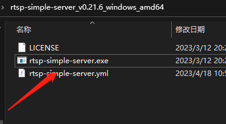

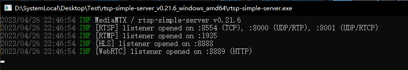
## 2、使用FFmpeg对本地视频推流
！**注意：需要先解压bin里的压缩包，取出其中的ffmpeg.exe到bin下，再将ffmpeg/bin目录配置到环境变量中，再进行推流操作**

推送本地摄像头，rtsp流 【注意修改参数】
```shell
ffmpeg -f dshow -i video="ov9734_azurewave_camera" -vcodec libx264 -r 30 -f rtsp rtsp://127.0.0.1:8554/live
```
推送本地摄像头，rtmp流 【注意修改参数】
```shell
ffmpeg -f dshow -i video="ov9734_azurewave_camera" -framerate 25 -bufsize 1000000k -vcodec libx264 -preset:v ultrafast -tune:v zerolatency -an -f flv rtmp://127.0.0.1:1935/live
```
推送本地视频，rtmp流，此处视频中没有火焰【注意修改参数】。
```shell
ffmpeg -re -stream_loop -1 -i .\src\main\resources\systemTestData\pushFlowTestVideos\liveVideoNoFire.mp4 -vcodec copy -an -f flv -y rtmp://127.0.0.1:1935/live2
```
推送本地视频，rtmp流，此处视频中有火焰 【注意修改参数】。
```shell
ffmpeg -re -stream_loop -1 -i .\src\main\resources\systemTestData\pushFlowTestVideos\liveVideoHasFire.mp4 -vcodec copy -an -f flv -y rtmp://127.0.0.1:1935/live1
```
&emsp;**注意：推流的视频地址为绝对路径。如果需要推流摄像头注意更改摄像头名称参数**

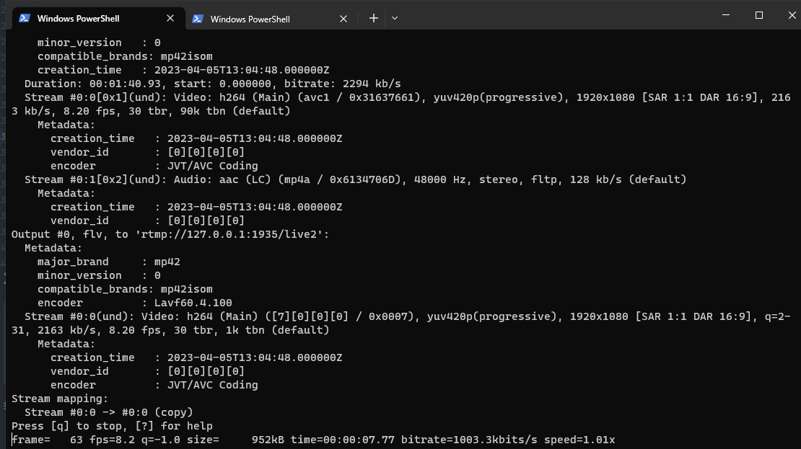

## 3、启动项目

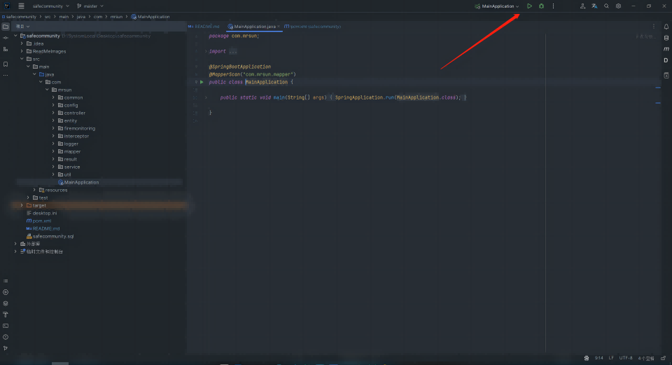

# 六、功能展示
## 1、监控及火情警报
### （1） 监控页面


### （2） 警报功能
&emsp;- **监控大屏处报警**

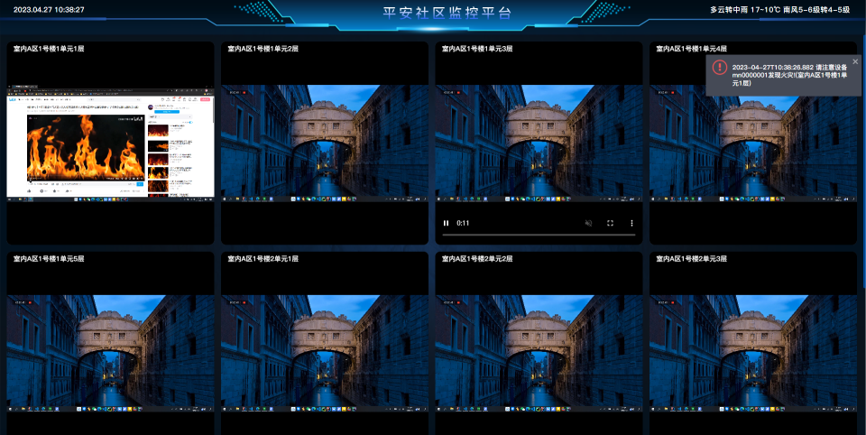

&emsp;- **钉钉报警**

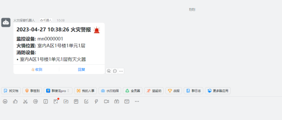

## 2、基本信息管理
### （1）监控设备信息管理

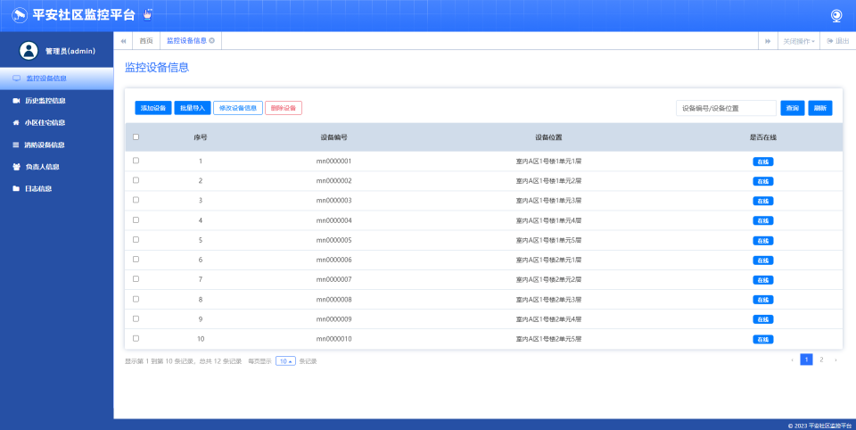

### （2）历史监控信息管理

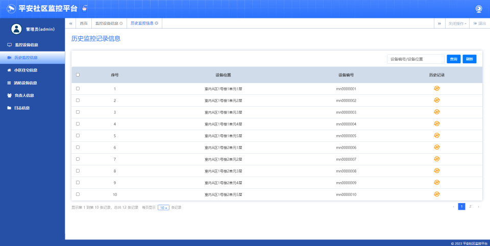

### （3）小区住宅信息管理
&emsp;&emsp;**说明：不允许该页面对住宅信息的基本部分做修改，因为考虑到这部分信息会在项目之前存在且具有重要性、固定性，所以只允许管理员在此处修改住户信息**

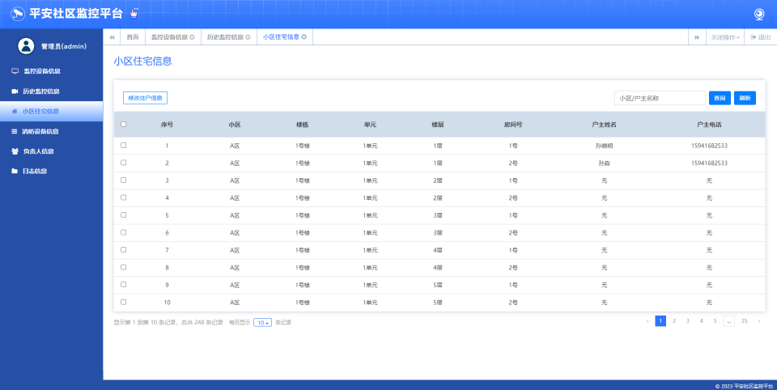

### （4）消防设备信息管理

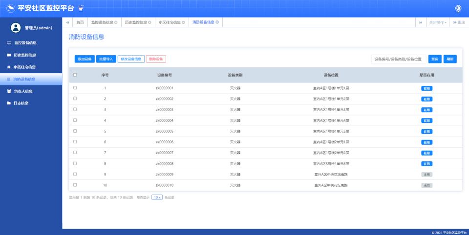

### （5）火情负责人信息管理
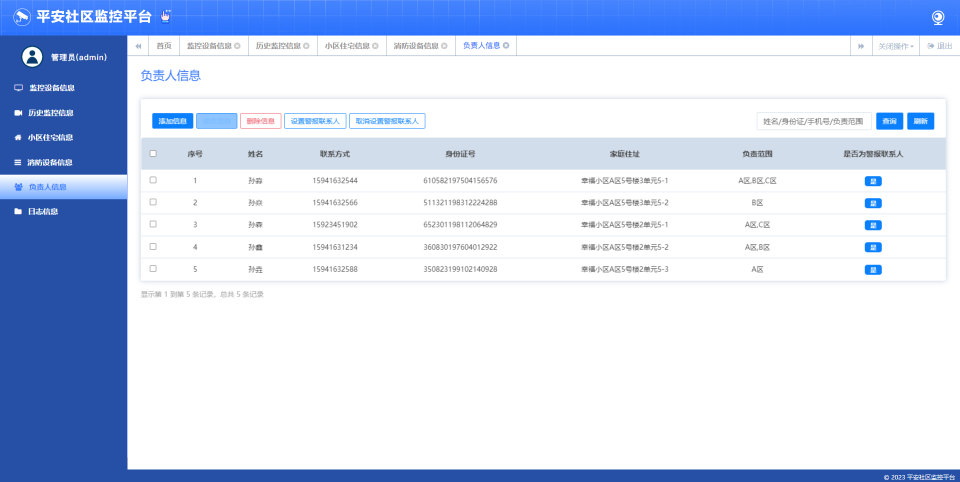

### （6）日志信息管理（用户操作日志，火情警报日志）
&emsp;- **用户操作日志**

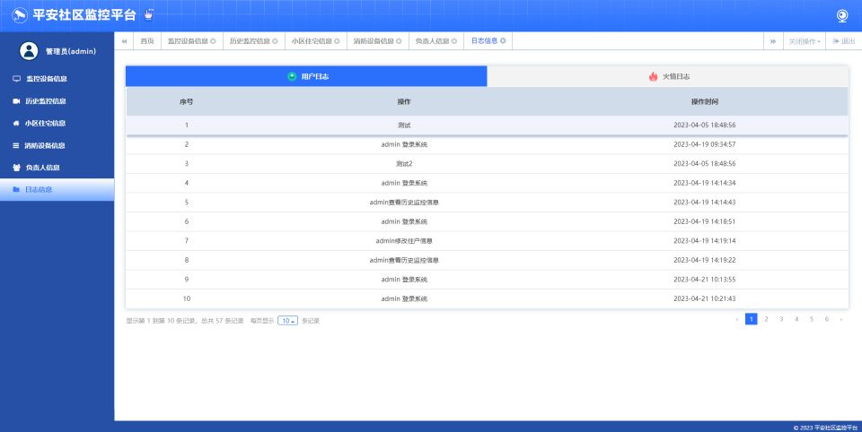

&emsp;- **火情警报日志**


# 七、疑难问题
&emsp;**该部分记录了项目开发过程中遇到的形形色色的问题。**
### 1.在训练模型时，需要安装 pytorch，但是安装后检查安装是否成功却一直False
>问题出现原因是清华源镜像没有GPU版本，导致实际下载的是CPU版本，可以使用 conde list 查看。所以可以去[官网](https://pytorch.org/get-started/previous-versions/)寻找与cuda对应版本的pytorch
<br>如: cuda 10.1<br>
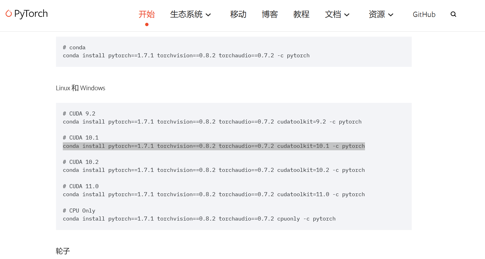


### 2.Vue中this关键字指向
&emsp;ajax的回调函数需要用箭头函数，否则this关键字指向的不是vue，详见 [博客: vue中this指向问题JingG459的博客](https://blog.csdn.net/JINGinC/article/details/120926465)
或者记住 **JavaScript中this关键字永远指向的是函数调用者**。

### 3.使用spring-security时，出现403问题----跨域问题
如果使用 spring-security，默认开启了防止跨域攻击的功能，任何 POST 提交到后台的表单都要验证是否带有 _csrf 参数，一旦传来的 _csrf 参数不正确，服务器便返回 403 错误；<br>
[参考博客](https://blog.csdn.net/shawearn1027/article/details/71119587#:~:text=%E4%BD%BF%E7%94%A8%E4%BA%86%20spring-security%20%E5%90%8E%EF%BC%8C%E9%BB%98%E8%AE%A4%E5%BC%80%E5%90%AF%E4%BA%86%E9%98%B2%E6%AD%A2%E8%B7%A8%E5%9F%9F%E6%94%BB%E5%87%BB%E7%9A%84%E5%8A%9F%E8%83%BD%EF%BC%8C%E4%BB%BB%E4%BD%95%20POST%20%E6%8F%90%E4%BA%A4%E5%88%B0%E5%90%8E%E5%8F%B0%E7%9A%84%E8%A1%A8%E5%8D%95%E9%83%BD%E8%A6%81%E9%AA%8C%E8%AF%81%E6%98%AF%E5%90%A6%E5%B8%A6%E6%9C%89%20_csrf%20%E5%8F%82%E6%95%B0%EF%BC%8C%E4%B8%80%E6%97%A6%E4%BC%A0%E6%9D%A5%E7%9A%84%20_csrf,%E5%8F%82%E6%95%B0%E4%B8%8D%E6%AD%A3%E7%A1%AE%EF%BC%8C%E6%9C%8D%E5%8A%A1%E5%99%A8%E4%BE%BF%E8%BF%94%E5%9B%9E%20403%20%E9%94%99%E8%AF%AF%EF%BC%9B%20%E8%A7%A3%E5%86%B3%E6%96%B9%E6%B3%95%E4%B8%80%EF%BC%9A%20form%20%E8%A1%A8%E5%8D%95%E4%B8%AD%E6%B7%BB%E5%8A%A0%20_csrf%20%E9%9A%90%E8%97%8F%E5%9F%9F)

### 4.Springboot实现可以直接访问Templates下的html文件
```xml
spring:
 resources:
   static-locations: classpath:/META-INF/resources/,classpath:/resources/,classpath:/static/,classpath:/public/,classpath:/templates/
```
### 5.springboot测试时bean对象空指针异常
@Test引入的包有问题，引入下面的包。
```java
import org.junit.jupiter.api.Test;
```

### 6.父页面向iframe传递数据

&emsp;方法一（推荐，相较于方法二可以把参数传出，在子页面全局使用）:
```html
<!--父页面-->
<iframe class="tosearchvideo" src="" style="width: 100%;height: 100%;border: 0;"></iframe>
<!--js修改src为xxx.html?data=xxx&data1=xxx-->
```
```javascript
//子iframe页面js：
//获取?后的数据
function GetRequest() {
    const url = location.search; //获取url中"?"符后的字串
    let theRequest = {};
    if (url.indexOf("?") !== -1) {
        const str = url.substr(1);
        const strs = str.split("&");
        for (var i = 0; i < strs.length; i++) {
            theRequest[strs[i].split("=")[0]] = unescape(strs[i].split("=")[1]);
        }
    }
    return theRequest;
}

var data1 = GetRequest()['data1'];
console.log(data1);
```
&emsp;方法二(没办法将参数传出,如果只是简单的执行动作可以用)：
```js
// 父页面js：
const frame = document.getElementsByClassName('tosearchvideo')[0];
frame.contentWindow.postMessage(data, '*'); //data也可以是对象

// 子页面js:
window.addEventListener('message', function (event) {
        //event.data获取传过来的数据
        const data = event.data;
    });
```

### 7.Springboot项目关闭时,资源的释放
[参考博客](https://my.oschina.net/evermaze/blog/1594330)

### 8.Mybatis-Plus实现对指定字段加密解密
[参考博客](https://juejin.cn/post/6963811586184052767)

# 八、最终总结
&emsp;截至2023年4月27日，本项目基本完成。项目完成了初期设计的基本功能，但仍存在诸多问题。

&emsp;问题1：这是最主要的问题，即视频流与火焰检测部分，目前采取的方案是通过ffmpeg截取视频流的某一帧获取图片，再读取图片进行检测。
YOLOv5实际支持对rtmp视频流的检测，<br>但在实际测试时，发现直接检测延迟较高，效果不如人意，因此采用了目前的方案。而目前的方案最大的问题是采用操作系统中ffmpeg程序完成的图片截取，所以每一个监控设备就会<br>对应一个系统进程，
极大的占用系统内存（所以运行后会感觉电脑很卡顿）。当然，java中也存在ffmpeg对应的api,但是问题依然是延迟太高，效果差，并且当推流的源是摄像头时，建<br>立连接的时间也很长，所以没有采用api的方式。

&emsp;问题2：在警报时对消防设备的查询目前实现的较为简单，只是查询跟监控设备同一位置的设备信息，可以考虑使用其他方式查询附近范围的所有设备。

&emsp;**... ...**
<br>
***
<div style="text-align: center;"><span   style="color: #f0ffff; font-size: x-large; font-family: 'Microsoft YaHei UI',serif; ">End.</span></div>

